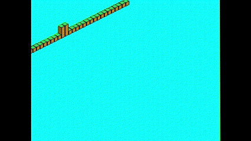

Messing about with sdl2 and rust. Grid size and zoom level configurable (kinda, you can increase the tile size, but there isnt actually a zoom button yet). Running this code requires sdl2 and additional sdl feature extras .lib files to be in your rust library folder (more info [here](https://github.com/Rust-SDL2/rust-sdl2))